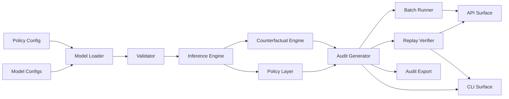

# C-DAG

**Replayable causal audit traces for high-risk AI decisions.**

## What is C-DAG?

C-DAG transforms AI decisions into replayable, inspectable, and verifiable audit artifacts for governance, compliance, and model-risk workflows. It exists because high-risk AI systems increasingly require more than a prediction: teams need to explain why a decision happened, test whether the outcome would change if evidence changed, replay the exact decision months later, and give auditors independently verifiable evidence.

---

## Evidence

* 100,000+ public financial records processed
* Deterministic replay validation
* Counterfactual generation
* Audit-chain verification
* Fairness diagnostics
* Public benchmark
* DOI-backed technical paper

Benchmark

https://cdag.quest/benchmark

Research

https://doi.org/10.5281/zenodo.19779499

C-DAG includes reference validation using public mortgage and complaint datasets including:

* Freddie Mac
* Fannie Mae
* HMDA
* CFPB

The reference implementation demonstrates governance workflows using historical public data.

It is **not** a lending system and **does not** make production credit decisions.

---

## Architecture



---

## Example audit artifact

Each decision produces structured governance artifacts including:

* decision
* confidence
* causal pathway
* counterfactual scenarios
* replay verification
* audit integrity
* model version
* policy version

These artifacts are designed for engineering, internal audit, compliance, and model-risk review.

---

## Quick Start

```bash
pip install -e ".[dev]"

python -m pytest -q

python -m causal_credit_risk.cli --json-only
```

---

## API

C-DAG includes a FastAPI surface for internal evaluation and integration testing.

```bash
uvicorn causal_credit_risk.api:app --reload
curl -s http://127.0.0.1:8000/healthz
```

Available routes:

* `GET /healthz`
* `GET /readyz`
* `POST /v1/decision`
* `POST /v1/replay`
* `POST /v1/batch`
* `POST /v1/fairness`
* `POST /v1/fairness/report`
* `POST /v1/audit-chain/verify`

Auth is intentionally not included in the local package. Apply authentication and authorization at the deployment boundary.

---

## Boundaries

C-DAG is:

* replayable governance infrastructure
* explainability layer
* source-available reference implementation
* public validation workflow for high-risk AI decision auditing

C-DAG is not:

* production lending software
* regulatory certification
* legal advice
* customer credit adjudication
* a system for making real credit eligibility decisions

---

## Documentation

Technical documentation, architecture, API references, governance workflows, and deployment guidance are available in the `/docs` directory.

---

## License

Business Source License 1.1

Commercial production use requires a commercial license from Antiparty, Inc.
