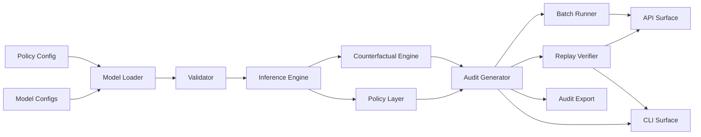

# C-DAG

**Replayable causal audit traces for high-risk AI decisions.**

## What is C-DAG?

C-DAG transforms AI decisions into replayable, inspectable, and verifiable audit artifacts for governance, compliance, and model-risk workflows. It exists because high-risk AI systems increasingly require more than a prediction: teams need to explain why a decision happened, test whether the outcome would change if evidence changed, replay the exact decision months later, and give auditors independently verifiable evidence.

---

## Evidence

* 100,000+ public financial records processed
* Deterministic replay validation
* Counterfactual generation
* Audit-chain verification
* Control-framework mapping
* Compliance-support package export
* Fairness diagnostics
* Public benchmark
* DOI-backed technical paper

Benchmark

https://cdag.quest/benchmark

Research

https://doi.org/10.5281/zenodo.19779499

C-DAG includes reference validation using public mortgage and complaint datasets including:

* Freddie Mac
* Fannie Mae
* HMDA
* CFPB

The reference implementation demonstrates governance workflows using historical public data.

It is **not** a lending system and **does not** make production credit decisions.

Governance Evidence

✓ Governance artifact schema
✓ Deterministic replay verification
✓ Replay hash validation
✓ Audit-chain verification
✓ Control-framework mapping
✓ Compliance-support package export
✓ Evidence-pack export
✓ Human review metadata and review history
✓ Model lifecycle metadata
✓ Fairness diagnostics
✓ Passing test suite

---

## Architecture



---

## Example audit artifact

Each decision produces structured governance artifacts including:

* decision
* risk probability
* causal pathway
* counterfactual scenarios
* replay verification
* replay hash
* audit-chain hash
* audit integrity
* model version
* policy version
* deployment version
* validation status
* control references
* review status

These artifacts are designed for engineering, internal audit, compliance, and model-risk review.

---

## Governance artifact

C-DAG can emit a schema-backed governance artifact for each decision. The artifact includes model and policy versions, input evidence, inferred nodes, risk probability, decision, causal chain, counterfactuals, replay hash, audit-chain hash, validation status, timestamp, boundary metadata, and optional human review fields.

Governance artifacts can be exported from the CLI, replay-verified, included in evidence packs, and returned by the decision API response.

---

## Compliance-support package

C-DAG produces evidence that supports governance, model risk management, internal audit, and regulatory compliance workflows.

Compliance-support packages include the governance artifact, replay verification, audit-chain verification, fairness report when available, model metadata, policy metadata, control mappings, an evidence manifest, and integrity hashes.

The default control registry maps artifact evidence to NIST AI RMF, ISO/IEC 42001, SR 11-7 Model Risk Management, EU AI Act high-risk obligations, and internal custom controls.

---

## Capabilities

* Governance artifact generation for replayable decision evidence.
* Deterministic control mapping for configured governance and compliance-support frameworks.
* Compliance-support package export and import with stable integrity hashes.
* Review assignment, comments, approval, rejection, escalation, and review history metadata.

---

## Quick Start

```bash
pip install -e ".[dev]"

python -m pytest -q

python -m causal_credit_risk.cli --json-only
```

---

## API

C-DAG includes a FastAPI surface for internal evaluation and integration testing.

```bash
uvicorn causal_credit_risk.api:app --reload
curl -s http://127.0.0.1:8000/healthz
```

Available routes:

* `GET /healthz`
* `GET /readyz`
* `POST /v1/decision`
* `POST /v1/replay`
* `POST /v1/batch`
* `POST /v1/fairness`
* `POST /v1/fairness/report`
* `POST /v1/audit-chain/verify`
* `GET /v1/control-frameworks`
* `GET /v1/control-mappings`
* `POST /v1/compliance-package`
* `POST /v1/review`

Auth is intentionally not included in the local package. Apply authentication and authorization at the deployment boundary.

---

## Boundaries

C-DAG is not a standalone production lending decision engine and does not independently determine consumer credit eligibility. It produces replayable governance evidence for teams evaluating, validating, auditing, or overseeing high-risk credit-decision systems.

C-DAG does not:

* serve as standalone production lending adjudication
* independently determine consumer credit eligibility
* certify regulatory compliance
* provide legal advice
* replace institutional governance programs
* replace human review or approval
* guarantee fairness or regulatory acceptance

---

## Documentation

Technical documentation, architecture, API references, governance workflows, and deployment guidance are available in the `/docs` directory.

Governance artifact: `docs/governance_artifact.md`

Compliance support: `docs/compliance_support.md`

Replay proof: `docs/replay_proof.md`

---

## License

Source-available software under BUSL-1.1, not OSI open-source.

Business Source License 1.1

Commercial production use requires a commercial license from Antiparty, Inc.
