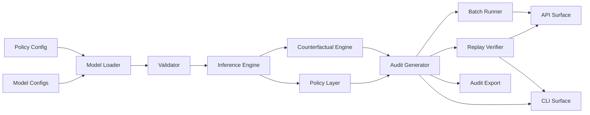

# Architecture

## Components

- Configs: externalized CPDs and policy parameters
- Model loader and validator: structural checks before runtime use
- Inference engine: exact discrete DAG inference
- Policy layer: action mapping (`APPROVE`/`REVIEW`/`DECLINE`)
- Counterfactual engine: intervention analysis
- Audit generator: regulator-facing structured output
- Replay verifier: deterministic recomputation checks
- Batch runner: row-level processing with error isolation
- CLI/API: operator and integration surfaces
